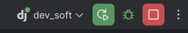

#  EstudaAI – Sistema de Recomendação de Trilhas de Aprendizagem

Membros:
- Gustavo Ebeling de Almeida
- Ian Erichsen Pacher De Araujo
- Guilerme Guimaraes Lopes
- Guilerme Diego Sanches
- Andre Tozi Magalhaes 
- Lucas Diniz Ferreira Masteguim 
- Lucas Oliveira Da Silva
- Joao De Sa Calvano Bezerra

|  Nome  |    RA    |
|:------:|:--------:|
|Gustavo Ebeling de Almeida| 10436455 |
| Ian Erichsen Pacher De Araujo  | 10427607 |
| Guilerme Guimaraes Lopes  | 10438391 |
| Guilerme Diego Sanches | 10436672 |
| Andre Tozi Magalhaes   | 10436460 |
| Lucas Diniz Ferreira Masteguim   | 10437300 |
| Lucas Oliveira Da Silva  | 10438940 |
| Joao De Sa Calvano Bezerra  | 10436734 |


---

## Indice

- [Installation](#installation)
- [Rodando o Django](#Rodando-o-Django)
- [Next Steps](#next-steps)


---

## Installation

1. No terminal do windows ou powershell, clone o repositorio no lugar que quiser:
````bash
cd caminho_da_pasta_que_você_quiser_salvar
````
```bash
git clone https://github.com/fenrir-mack/dev_soft.git
cd dev_soft
```

2. Crie um ambiente virtual:
```bash
python -m venv venv
```

3. Ative o ambiente virtual:

```powershell
venv\Scripts\activate
```

4. instale as dependencias:
```bash
pip install -r requirements.txt
```

---

## Rodando o Django

Rode o server de desenvolvimento do Django:

```bash
python manage.py runserver
```

Teste as saidas:

- mapa com todas URLs http://127.0.0.1:8000/sitemap/

--- 
Como configurar para que não precise rodar o Django por comando:  

Primeiro em configuações **Edit Configurations**:  


Clique no botão **(+)** e selecione **Django Server**.


Mude o **host** para `127.0.0.1` e a **porta** para `8000`:  


Depois vamos configurar o Django no Pycharm: 

Ou va por Files->Settings, Languages and frameworks->django


Habilite ele, use a pastinha no canto direito para facilitar o preenchimento

No primeiro input você deve colocar a pasta backend, na segunda é backend/config/settings.py, e no terceito backend/manage.py

Com isso voce deveria conseguir apertar o botão play no topo e ja conseguiria acessar as paginas



---

## Next Steps

- See the YoutTrack page for more informations

https://eemackenzie.youtrack.cloud/dashboard?id=169-0 


---
